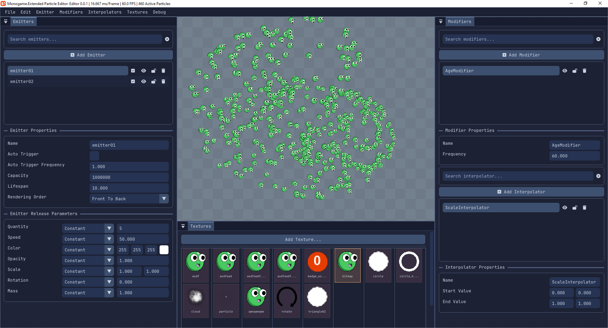

Hi everyone,

It's been nearly a year since my last update, and I wanted to reach out to the community with some important news about the future of **MonoGame.Extended**. But before I get to the main announcement, I need to address a few things and share some updates on what's been happening behind the scenes.

<!-- truncated -->

## Catching Up and Apologies

First, I owe everyone an apology for the delay in project updates and communication. I know many of you have been waiting for progress reports and wondering about the direction of **MonoGame.Extended**. The truth is, I've been deeply involved in other MonoGame community work that has taken significant time and focus.

Over the past year, I've been working extensively on the [MonoGame 2D Onboarding Tutorial](https://docs.monogame.net/articles/tutorials/building_2d_games/), which is now available in the official MonoGame documentation. This comprehensive tutorial series was a major undertaking aimed at helping new developers get started with MonoGame, and while it meant less visible progress on **MonoGame.Extended**, I believe it serves the broader community that **MonoGame.Extended** is part of.

## What's Been Happening

Despite the quieter public presence, work on **MonoGame.Extended** has continued. I've been deep in the process of updating the particle system, which was one of the most requested and sponsored by a community member. This is more than just a simple update; it's a designed to be more performant, flexible, and easier to use.

Along with the particle system refactor, I've been developing **Ember**, a new GUI editor specifically for creating and managing particle effects. This tool will make it dramatically easier for developers to create complex particle systems without having to hand-code everything.

I also want to take a moment to acknowledge and thank Jeremy ([kaltinril](https://github.com/kaltinril)) for his incredible effort in updating and improving our documentation. Good documentation is crucial for any library's success, and Jeremy has been working tirelessly to make sure our docs are clear, comprehensive, and helpful for both new and experienced users. His contributions have made a real difference in the project's accessibility.

## A New Official Home

Now, for the main announcement. After careful consideration and valuable feedback from the community members I"ve reached out to,  I'm excited to announce that **MonoGame.Extended** has moved to a new official home:

The repository has been transferred from the `craftworkgames` organization to a new dedicated organization called [**MonoGame-Extended**](https://github.com/MonoGame-Extended/Monogame-Extended) on GitHub.

**Why this change makes sense:**

- **Clear identity and ownership** - The new organization makes it immediately clear what the project is and creates an official presence in the ecosystem
- **Long-term sustainability** - Rather than being tied to any individual maintainer, the project now has an organizational structure that can support leadership transitions and growth
- **Room for expansion** - The organization provides space for additional repositories including samples, demos, templates, tools like Ember, and other **MonoGame.Extended** related projects

**What this means for you:**

- **Everything transfers intact** - All stars, forks, issues, pull requests, and the complete project history will move with the repository
- **Seamless transition** - GitHub automatically handles URL redirects, so your existing bookmarks and links will continue to work
- **Continued commitment** - The same dedication to quality and community that brought you version 4.0.0 and the ongoing improvements continues unchanged

## Acknowledging Our Foundation

I want to take a moment to properly acknowledge the people who made **MonoGame.Extended** what it is today. Dylan (craftworkgames) created something truly special when he built the original **MonoGame.Extended**. His vision and foundational work created a library that has served countless developers and projects over the years. When Dylan was no longer able to maintain the project, Lucas ([lithiumtoast](https://github.com/lithiumtoast)) stepped in, working to keep things moving when the project needed continuity.

Both of their contributions and other community members laid the essential groundwork that made it possible for me to pick up the project and bring it back to active development. **MonoGame.Extended** stands on the shoulders of their efforts, and this new chapter is built upon the solid foundation they created.

## Moving Forward

This move represents the natural evolution of **MonoGame.Extended** as it enters a new phase of active development and community growth. With the particle system refactor and Ember nearing completion, improved documentation, and now an official organizational home, the project is positioned for continued success and expansion.

The **MonoGame.Extended** community has been incredible throughout this journey. Your feedback, contributions, bug reports, and continued usage of the library have been invaluable in bringing the project back to life and pushing it forward. This new foundation ensures that community energy and contribution can continue to drive the project's growth.

If you have any questions or concerns about this transition, please feel free to reach out in the comments below or find me on the [MonoGame.Extended Discord](https://discord.gg/FvZ8Z7EzPJ).

Here's to the next chapter of **MonoGame.Extended**.

Thanks everyone,

\- ❤️ Aris