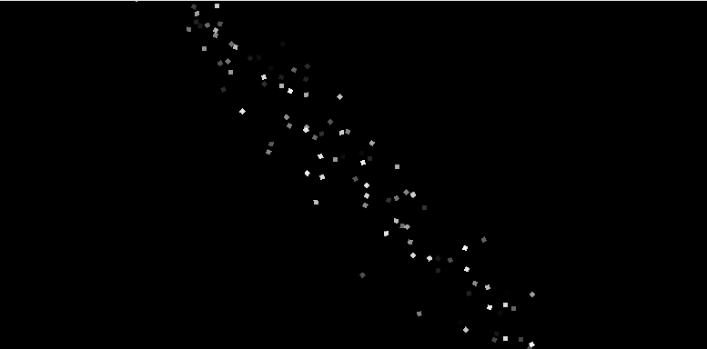
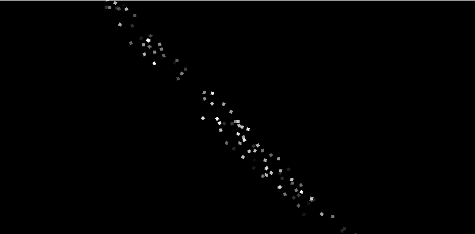
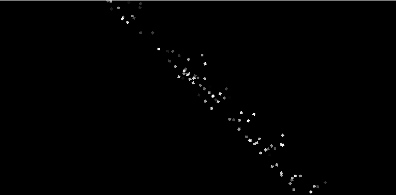

Hi everyone,

Quick update that MonoGame Extended version 5.1.0 has been released.  This release brings some updates to the particle system refactor that was done as part of the 5.0.0 release.  After working through through updating the particle documentation, I noticed that some of the implementations seemed off or didn't work as expected, so in tandem with documenting, I also did some updates.

## What's Changed

### Load Ember Particle Effects From File/Stream

The `ParticleEffect.FromFile` and `ParticleEffect.FromStream` methods have been implemented.  This is in preparation for the full release of the Ember Particle Editor that will be coming very soon to visually create particle effects.  

Reference: [https://github.com/MonoGame-Extended/Monogame-Extended/pull/1023](https://github.com/MonoGame-Extended/Monogame-Extended/pull/1023)

### Modifier Frequency

There was a bug in the core implementation of the modifiers where the `Frequency` property was not actually being used.  The purpose of this property is to control the frequency in which the modifier updates particles so you can fine tune the system in performance heavy scenarios.  This was a property that was in the original Mercury Particle Engine, but when that was ported over to MonoGame Extended, it was left unused.  

Reference: [https://github.com/MonoGame-Extended/Monogame-Extended/pull/1025](https://github.com/MonoGame-Extended/Monogame-Extended/pull/1025)

### Line Profile Radiation Modes

When using the `LineProfile` in the particle system, there is now a `Radiation` property that can be set.  This property allows you as the user to control how particles emissions radiate from the line itself.  The default behavior before this was that particles would emit with a randomly chosen velocity from the line.  This is still the default behavior for backwards compatability and is what happens when using the `LineRadiation.None` value.  See the table below for what each radiation mode does

| Line Radiation                    | Description                                     | Visual Effect                                                                   |
| --------------------------------- | ----------------------------------------------- | ------------------------------------------------------------------------------- |
| `LineRadiation.None`              | Random directions regardless of line angle      |                            |
| `LineRadiation.Directional`       | All particles move in the specified direction   |              |
| `LineRadiation.PerpendicularUp`   | Particles move perpendicular upward from line   |      |
| `LineRadiation.PerpendicularDown` | Particles move perpendicular downward from line |  |

Reference: [https://github.com/MonoGame-Extended/Monogame-Extended/pull/1027](https://github.com/MonoGame-Extended/Monogame-Extended/pull/1027)

### Vortex Modifier

While documenting the various modifiers, I noticed something strange about the `VortexModifier`....it didn't actually create or simulate any type of vortex.  Instead it acted as a gravity well, or an acctractor that just pulled particles into its center mass and expelled them out.  We can't have this, if we're going to call it a `VortexModifier` it needs to create a vortex.  So this modifier was updated to do what it says now

Reference: [https://github.com/MonoGame-Extended/Monogame-Extended/pull/1031](https://github.com/MonoGame-Extended/Monogame-Extended/pull/1031)

## Conclusion

With this release done and the documentation completed for the particle system, I can now focus on finishing up the documentation for the Ember Particle Editor to so we can do an official release of it.  If you want to read the new documentation on particles, you can start with the [Quick Start Guide](../../../docs/features/particles/quick_start_guide.md).

Once Ember documentation is completed and a full release made, the particle system will go into maintenance mode while focus is shifted to work on tne tile map system in MonoGame Extended.  Hope you all are looking forward to that.

Happy Coding,

\- ❤️ Chris Whitley ([AristurtleDev](https://github.com/aristurtledev))
