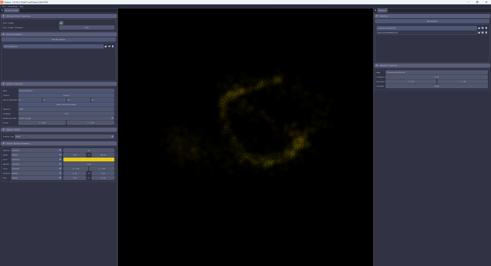

Hi everyone,

I'm excited to announce the release of MonoGame Extended version 5.1.1, which officially launches **Ember**, the particle effect editor for MonoGame Extended!

If you've been following along, you may remember that Ember had a soft release for community feedback. Well, that feedback period is over, and I'm thrilled to share that Ember is now ready for its full public release. This 5.1.1 update to MonoGame Extended ensures full compatibility with Ember's file format and workflow.

- GitHub: [https://github.com/monogame-extended/monogame-extended](https://github.com/monogame-extended/monogame-extended)
- Release Notes: [https://github.com/MonoGame-Extended/Monogame-Extended/releases/tag/v5.1.1](https://github.com/MonoGame-Extended/Monogame-Extended/releases/tag/v5.1.1)
- Ember GitHub: [https://github.com/MonoGame-Extended/Ember](https://github.com/MonoGame-Extended/Ember)

## What Is Ember?

Ember is a standalone particle effect editor built specifically for the MonoGame Extended particle system. It provides a visual, real-time environment for creating, editing, and fine-tuning particle effects without having to recompile your game every time you want to tweak a value.

The editor is built using MonoGame itself (DesktopGL) with a Dear ImGui interface, which means what you see in Ember is exactly what you'll get in your game. 

## Key Features

- **Real-time visual editing** - See your particle effects update instantly as you adjust parameters
- **Complete particle system support** - Full access to all emitters, modifiers, profiles, and parameters
- **Project-based workflow** - Save your effects as `.ember` files that can be loaded directly into your MonoGame Extended projects
- **Accurate rendering** - Built on MonoGame DesktopGL to ensure perfect rendering fidelity

## Getting Started with Ember

Head over to the [Ember documentation](../../../docs/tools/ember) to get started. The quick start guide will walk you through downloading Ember, creating your first particle effect, and loading it into your MonoGame Extended project.

For those who have been using the particle system programmatically, you'll find that Ember integrates seamlessly with your existing workflow. Effects created in Ember can be loaded using the `ParticleEffect.FromFile()` method that was introduced in version 5.1.0.

## What's Next?

With Ember officially released and the particle system documentation complete, the particle system will be entering maintenance mode. This means I'll continue to fix bugs and address issues, but no major new features are planned for the immediate future.

My focus is now shifting to the tile map system in MonoGame Extended. There's a lot of exciting work planned there, and I'm looking forward to bringing the same level of polish and tooling to tile maps that we've achieved with the particle system.

Thank you to everyone who provided feedback during the soft release period. Your input helped shape Ember into a tool that I hope you'll find invaluable for your projects.

Happy particle creating!

\- ❤️ Chris Whitley ([AristurtleDev](https://github.com/aristurtledev))
