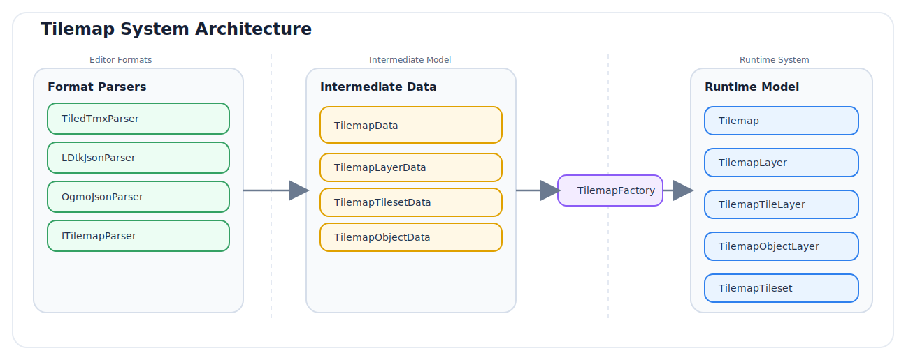
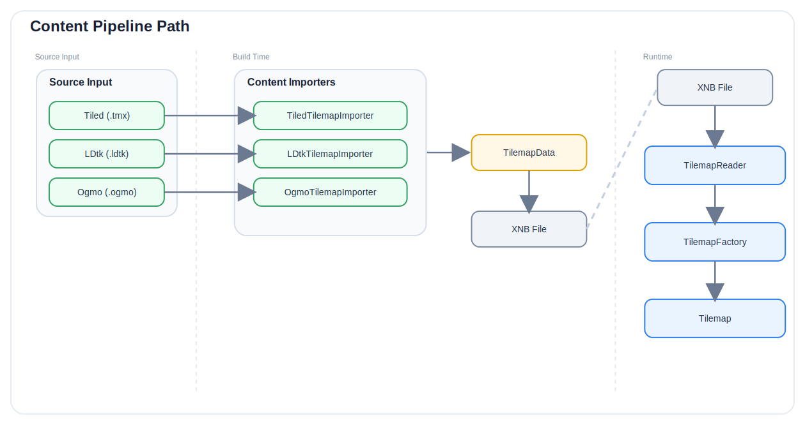
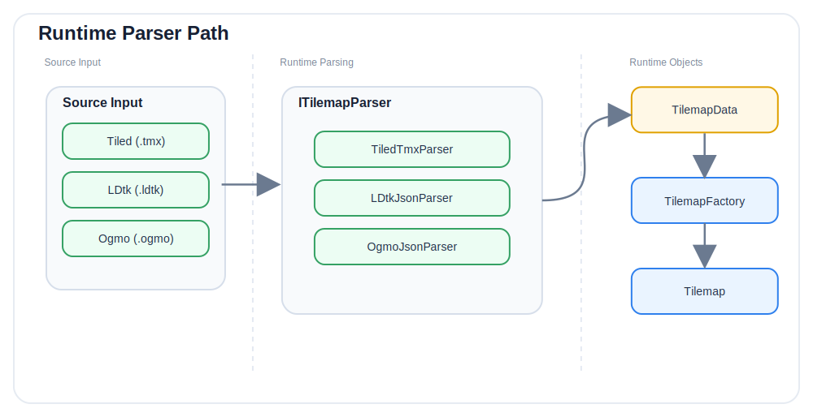

:::note[Preview release]
This feature is currently only available in the preview release **6.0.0-preview.1**. If you find outdated information, [please open an issue](https://github.com/monogame-extended/monogame-extended.github.io/issues).

Samples are available in the [`version/6.0.0` branch of MonoGame-Extended-Samples](https://github.com/MonoGame-Extended/MonoGame-Extended-Samples/tree/version/6.0.0/src/Tilemaps).
:::

This document covers the internal architecture of the tilemap system: how maps are loaded, how the runtime object graph is constructed, how rendering works at a low level, and how coordinate conversions are implemented for each orientation.

## System Architecture Overview

The tilemap system is divided into three layers: format parsers, an intermediate data model, and the runtime model.




The format parsers each convert their source files into `TilemapData`, a format-agnostic intermediate representation. `TilemapFactory` then constructs the runtime `Tilemap` from that intermediate form. This separation means the renderers and game code never need to know which editor produced the map.

## Two Loading Paths

### Content Pipeline Path



The content pipeline bakes the map data at build time. The `TilemapReader` deserializes the binary `.xnb` file at runtime. Textures are loaded as external references by the content pipeline, which means they are premultiplied by default.

### Runtime Parser Path



Runtime parsers read the map file and any referenced textures directly from streams. By default, those streams are opened from disk. Textures loaded this way are not premultiplied, which is why the renderer defaults to `BlendState.NonPremultiplied`.

External dependencies can be opened through an `ExternalResourceResolver` instead of direct file access. The parser still receives the root source as either a file path or stream, but dependent files and textures are opened through the configured resolver. This keeps runtime loading compatible with file-system projects while allowing callers to route dependencies through `TitleContainer`, a virtual file system, or another platform-specific stream source.

## TilemapFactory: Building the Runtime Graph

`TilemapFactory.Build()` converts a `TilemapData` into a `Tilemap`. The process is:

1. Create the root `Tilemap` with core map properties (dimensions, orientation, parallax origin, background color, custom properties).
2. For each tileset entry, build a `TilemapTileset`: load the texture, apply margin and spacing to calculate tile regions, populate per-tile animation and collision data.
3. For each layer, recursively build the layer object. Group layers are flattened: child layer names are prefixed with the parent group name using a forward slash separator (for example, a layer named `Walls` inside a group named `Level` becomes `Level/Walls`).
4. For tile layers, decode each non-empty tile entry into a `TilemapTile` struct containing the global ID and flip flags.
5. For object layers, construct the appropriate `TilemapObject` subclass for each object and populate its properties.
6. For image layers, load the texture from disk and apply the repeat-tiling flags.
7. For data layers, record the grid dimensions but produce no tile data. These represent LDtk IntGrid layers, which carry numeric cell values rather than renderable tiles.

## Global ID (GID) System

The global tile ID is the primary way tiles are identified across the entire map. Each tileset has a `FirstGlobalId`, and the local tile position within the tileset is calculated as:

```
localId = globalId - tileset.FirstGlobalId
```

The `TilemapTilesetCollection` resolves a GID to its owning tileset by finding the tileset where:

```
tileset.FirstGlobalId <= globalId < tileset.FirstGlobalId + tileset.TileCount
```

A global ID of 0 means the tile cell is empty.

## Tile Flip Encoding

Flip flags are stored in a three-bit flags enum: `FlipHorizontally`, `FlipVertically`, `FlipDiagonally`. The diagonal flag follows Tiled's convention where it encodes rotation rather than a true diagonal mirror. The eight combinations map to specific render operations:

| Horizontal | Vertical | Diagonal |                                                            |
| :----------: | :--------: | :--------: | ---------------------------------------------------------- |
| 0          | 0        | 0        | no transformation                                          |
| 1          | 0        | 0        | flip horizontally                                          |
| 0          | 1        | 0        | flip vertically                                            |
| 1          | 1        | 0        | flip horizontally and vertically (180 degree rotation)     |
| 0          | 1        | 1        | rotate 90 degrees clockwise                                |
| 1          | 0        | 1        | rotate 90 degrees counterclockwise                         |
| 1          | 1        | 1        | rotate 90 degrees clockwise, then flip horizontally        |
| 0          | 0        | 1        | rotate 90 degrees counterclockwise, then flip horizontally |


The two renderers implement the diagonal flip case differently:

- `TilemapSpriteBatchRenderer`: uses `SpriteBatch.Draw` with an explicit rotation angle and the tile center as the pivot. H and V flags map to `SpriteEffects`; the D flag selects the rotation angle.
- `TilemapRenderer`: swaps the U and V texture coordinate axes in the GPU buffer at load time. No rotation is needed; the flip is baked into the UV coordinates of the tile quad.

Both approaches produce identical visual results for all eight combinations.

## Rendering Pipeline

### TilemapSpriteBatchRenderer

The renderer iterates the layer list and issues draw calls per visible tile. The high-level flow per frame is:

```
foreach layer in tilemap.Layers:
    if not visible: skip
    if TilemapImageLayer:  DrawImageLayer (own Begin/End)
    if TilemapObjectLayer: DrawObjectLayer (own Begin/End)
    if TilemapTileLayer:
        if parallax factor differs from current batch:
            End current batch (if open)
            Begin new batch with parallax view matrix
        DrawTileLayerCore (frustum culled)

End batch if still open
```

#### Parallax Layer Batching

Consecutive tile layers that share the same `ParallaxFactor` are drawn within a single `SpriteBatch.Begin/End` pair. When the parallax factor changes, the current batch is ended and a new one is opened with a different view matrix. Image layers and object layers always require their own batch.

A map with ten tile layers that all have `ParallaxFactor = Vector2.One` produces exactly one `SpriteBatch.Begin/End` pair for all tile drawing.

#### Parallax View Matrix Calculation

For a tile layer with parallax factor `F` and a parallax origin point `O`, the effective world position of the viewport top-left corner is:

```
visibleLeft = O.X + (cameraLeft - O.X) * F.X
visibleTop  = O.Y + (cameraTop  - O.Y) * F.Y
```

The parallax offset applied to the view matrix is:

```
offset = (Vector2.One - F) * (cameraTopLeft - parallaxOrigin)
```

This offset is pre-multiplied into the view matrix before passing it to `SpriteBatch.Begin`. Snapping the translation components of the final matrix to integer pixels prevents sub-pixel sampling artifacts when the camera is at a fractional world position.

#### Frustum Culling

For each tile layer, the renderer computes the visible tile region in tile coordinates before iterating. This limits draw calls to only the tiles within the camera's view:

```
worldLeft  = parallaxOrigin.X + (cameraLeft - parallaxOrigin.X) * parallax.X - layerOffset.X
worldTop   = parallaxOrigin.Y + (cameraTop  - parallaxOrigin.Y) * parallax.Y - layerOffset.Y

startX = max(0, floor(worldLeft / tileWidth))
startY = max(0, floor(worldTop  / tileHeight))
endX   = min(layerWidth,  ceil((worldLeft + cameraWidth) / tileWidth))
endY   = min(layerHeight, ceil((worldTop  + cameraHeight) / tileHeight))
```

The result is a rectangle in tile coordinates. `TilemapTileLayer.GetTilesInRegion` yields only the non-empty tiles within that rectangle using a straightforward nested loop with no allocation beyond the iterator.

#### Tile Animation (SpriteBatch renderer)

`LoadTilemap` collects all `TilemapTileData` objects that have a non-null `Animation` into a flat list. During `Update`, every animation advances its elapsed time and switches frames when the current frame's duration is exceeded.

During rendering, if a tile has an animation, the local tile ID used for the source rectangle is replaced with `tileData.Animation.CurrentFrame.TileId`. All instances of an animated tile share the same `TilemapTileAnimation` object so they always advance together.

---

### TilemapRenderer

`TilemapRenderer` uses `GraphicsDevice` directly with `VertexBuffer`, `IndexBuffer`, and a built-in `DefaultEffect`. The tile geometry is fully pre-computed at load time and stored in GPU memory.

#### Load-time Buffer Construction

At `LoadTilemap`, the renderer iterates all tile layers and builds `VertexPositionColorTexture` arrays. Each tile produces a quad of four vertices:

```
topLeft = (worldX, worldY)
topRight = (worldX + width, worldY)
bottomLeft = (worldX, worldY + height)
bottomRight = (worldX + width, worldY + height)
```

UV coordinates are normalized to the `[0, 1]` range from the tileset texture dimensions using direct edge-to-edge mapping (no texel inset). Flip flags are applied by swapping the corresponding UV components at this point, so no per-frame transform is needed during drawing.

Layer opacity is baked into the vertex color alpha channel at load time. The indices use counter-clockwise winding to match MonoGame's default `CullCounterClockwiseFace` rasterizer state. 32-bit indices are used throughout to support groups larger than 16 383 tiles, which is the limit for 16-bit indices.

The resulting buffers are uploaded to the GPU as `BufferUsage.WriteOnly` static buffers, which the GPU driver can place in optimal memory for read-heavy rendering.

#### Layer Groups

Layer groups allow multiple tile layers to be merged into a single set of vertex and index buffers, reducing draw calls further. When a group is drawn, tiles are processed in layer order and batched into contiguous runs that share the same texture and parallax factor. A new draw call is issued whenever either changes. This preserves back-to-front draw order while minimizing GPU texture binds.

```
group "Background" contains layers: Sky, Clouds, Mountains
  -> tiles processed in layer order, batched by (texture, parallax factor)
  -> one DrawIndexedPrimitives call per contiguous batch
```

A group is marked dirty when:
- Any layer it contains has its visibility toggled
- `MarkGroupDirty` is called explicitly (for example after tile modifications)
- An animated tile within the group advances to a new frame

When a dirty group is drawn, `RebuildLayerGroupInternal` is called before issuing any draw calls. This rebuilds the CPU-side vertex/index lists, creates new GPU buffers, and disposes the old ones.

#### Parallax in TilemapRenderer

Rather than modifying the view matrix per batch, `TilemapRenderer` applies parallax through the `World` matrix. Before drawing each layer model, it sets:

```
offset = (Vector2.One - parallaxFactor) * (cameraTopLeft - parallaxOrigin)
World  = Matrix.CreateTranslation(offset.X, offset.Y, 0)
```

The effect vertex shader multiplies `World * View * Projection`, so this translation shifts the entire layer's pre-baked geometry by the parallax offset without modifying the view matrix.

#### Tile Animation (GPU renderer)

`Update` advances the same shared `TilemapTileAnimation` objects as the SpriteBatch renderer. The difference is what happens when a frame changes: instead of reading the current frame ID at draw time (as the SpriteBatch renderer does), `TilemapRenderer` must rebuild the group's GPU buffers because the UV coordinates of animated tiles are baked in.

The renderer tracks which groups contain animated tile layers. When `Update` detects that any animation frame has changed, it calls `MarkGroupDirty` for each affected group and sets a dirty flag on the merged ungrouped buffer. The buffers are rebuilt the next time those groups are drawn.

This means animated tiles inside large groups cause a full group buffer rebuild on every frame change. To minimize this cost, isolate animated tile layers in their own small groups so only the affected buffers need rebuilding.

#### World Mode

World rendering is handled by the dedicated `TilemapWorldRenderer` class, not by `TilemapRenderer`. `TilemapWorldRenderer.Load` accepts a `TilemapWorld` (or `IEnumerable<Tilemap>`) and reads each tilemap's `WorldPosition` and `WorldDepth` properties, which are set by the content pipeline from the world file data. For each level's tile layers it builds vertex buffers with the world-space position offset pre-applied to every tile vertex, grouping batches by `(WorldDepth, texture, parallaxFactor)`.

At draw time, `Draw(camera, worldDepth)` skips any level whose axis-aligned bounding rectangle does not intersect the camera's bounding rectangle, providing coarse level culling without per-tile frustum testing.

`TilemapWorldSpriteBatchRenderer` provides the same world-rendering capability with SpriteBatch. It adds per-room and per-tile frustum culling and animated tile support. Draw batches are grouped by `(WorldDepth, parallaxFactor)` and one `SpriteBatch.Begin/End` pair is issued per group.

#### Mixing with SpriteBatch

`BeginDraw` saves the current `GraphicsDevice` state (blend, sampler, rasterizer, depth stencil) and configures the effect matrices. `EndDraw` restores the saved state.

Within a `BeginDraw/EndDraw` block, calling `SpriteBatch.Begin/End` will overwrite `GraphicsDevice` state. To continue using the renderer after a SpriteBatch call, bracket the SpriteBatch usage with `SaveGraphicsDeviceState` and `RestoreGraphicsDeviceState`:

```
BeginDraw(camera)                 -- saves original GraphicsDevice state, sets effect matrices
  DrawLayerGroup("BG")            -- draws using saved effect matrices
  SaveGraphicsDeviceState()       -- saves renderer's GraphicsDevice state
  SpriteBatch.Begin/End           -- overwrites GraphicsDevice state
  RestoreGraphicsDeviceState()    -- restores renderer's GraphicsDevice state
  DrawLayerGroup("FG")            -- draws correctly with restored state
EndDraw()                         -- restores original GraphicsDevice state
```

#### Oversized Tiles

Both renderers apply the same correction for tilesets that define tiles larger than the layer grid cell. The draw position Y is adjusted upward by the height overhang:

```
drawPosition.Y -= max(0, tileset.TileHeight - layer.TileHeight)
```

## Coordinate System Conversions

All coordinate conversions are handled by `Tilemap.TileToWorldPosition` and `Tilemap.WorldToTilePosition`, dispatching to an orientation-specific implementation.

### Orthogonal

The simplest case. Tile coordinates map directly to pixel coordinates by multiplying by the tile dimensions:

```
worldX = tileX * tileWidth
worldY = tileY * tileHeight

tileX = floor(worldX / tileWidth)
tileY = floor(worldY / tileHeight)
```

### Isometric

Isometric maps use a diamond grid. Each tile is displayed rotated 45 degrees with a 2:1 width-to-height ratio:

```
worldX = (tileX - tileY) * (tileWidth  / 2)
worldY = (tileX + tileY) * (tileHeight / 2)

tileX = floor((worldX / halfTileWidth  + worldY / halfTileHeight) / 2)
tileY = floor((worldY / halfTileHeight - worldX / halfTileWidth)  / 2)
```

The world bounds of an isometric map are calculated as:

```
worldWidth  = (mapWidth  + mapHeight) * (tileWidth  / 2)
worldHeight = (mapWidth  + mapHeight) * (tileHeight / 2)
```

### Staggered

Staggered maps are similar to isometric but every other row (or column) is offset by half a tile. The stagger axis and stagger index control which axis is offset and whether even or odd indices are shifted:

For stagger axis Y (rows are offset):
```
isStaggered = (staggerIndex == Odd) ? (row % 2 != 0) : (row % 2 == 0)
worldX = col * tileWidth + (isStaggered ? tileWidth / 2 : 0)
worldY = row * (tileHeight / 2)
```

### Hexagonal

Hexagonal maps extend the staggered model by accounting for the flat edge length of each hexagon (`HexSideLength`). The step between rows (Y axis) or columns (X axis) becomes:

```
rowStep = (tileHeight + hexSideLength) / 2   (for stagger axis Y)
colStep = (tileWidth  + hexSideLength) / 2   (for stagger axis X)
```

Otherwise the stagger offset logic is the same as the staggered case.

## Properties System

`TilemapProperties` stores typed key-value pairs. Each value has an explicit `TilemapPropertyType`: `String`, `File`, `Int`, `Float`, `Bool`, `Color`, or `Object`. The typed getter methods (`GetString`, `GetInt`, etc.) return a safe default when the key is missing or the type does not match, which avoids exceptions in production code.

The `Object` type stores an integer ID that refers to another object in the same map by its `Id` property. Object references are not resolved automatically at load time; you are responsible for looking up the referenced object by ID when needed.

## Format-Specific Notes

### Tiled

- Tile layer data supports CSV, base64 (uncompressed), base64 (gzip), and base64 (zlib) encoding. All formats are decoded transparently.
- External tilesets (`.tsx`) are resolved relative to the `.tmx` file path by default. Runtime loading can override dependency loading by passing an `ExternalResourceResolver` to `TiledTmxParser`.
- Group layers are supported and flattened during factory construction.
- Tile objects support all flip flags and an independent size that may differ from the source tile's natural dimensions.

### LDtk

- LDtk's IntGrid layers are loaded as `TilemapDataLayer`, which stores dimension information but contains no renderable tiles. Access the raw integer grid values through custom properties or by parsing the original file if needed.
- External LDtk level files are resolved relative to the `.ldtk` project path by default. Runtime loading can override dependency loading by passing an `ExternalResourceResolver` to `LDtkJsonParser`.
- LDtk entities are converted to `TilemapObject` instances within object layers. Entity field values are stored as custom properties on each object.
- LDtk layers are stored in reverse order in the project file. The converter reverses them so they render top-to-bottom in the same order as displayed in the LDtk editor.

### Ogmo

- An Ogmo `.ogmo` file is a project file that defines layer templates, entity templates, and tileset configurations. It does not contain level data. Level data lives in separate `.json` files discovered from the directories listed in the project's `levelPaths` field. When using the content pipeline, add the `.ogmo` file as the content item and set the **Level Name** processor property to the filename of the desired level (without the `.json` extension). If left empty, the first discovered level is used.
- Runtime loading can override dependency loading by passing an `ExternalResourceResolver` to `OgmoJsonParser`. The resolver is used for the project file, level files, tileset image dimension probing, and texture loading.
- Ogmo tileset images can be embedded as base64-encoded PNG data URIs in the project file. The factory decodes these and creates a `Texture2D` directly from the data.
- Ogmo entity layers are converted to `TilemapObjectLayer`. Entity template properties are merged with instance values, with instance values taking precedence.
