The Ember editor is a visual particle effect editor for MonoGame Extended's particle system. It provides an intuitive interface for creating, configuring, and previewing particle effects without writing code.

## Download

Download ember from the latest release tag at https://github.com/MonoGame-Extended/Ember/releases/tag/v1.0.3

## Getting Started

When you launch Ember, you will be greeted with an empty workspace. The editor requires a project to be created or opened before you can begin working with particle effects.

### Creating a New Project

To create a new particle effect project:

1. Select **File > New Project** from the main menu
2. In the New Project dialog:
   - Enter a **Project Name** for your project (e.g. "Fire Effect", "Explosion").
   - Choose a **Project Directory** where the project file will be saved.
   - Optionally, check **Create Project Directory** to create a subfolder with the project name.
3. Click **Create** to create the project.

The editor will create a new particle effect with default settings and open it in the workspace.

### Opening an Existing Project

To open an existing particle effect project:

1. Select **File > Open Project** from the main menu.
2. Navigate to and select an existing `.ember` particle effect file.
3. Click **Open**.

The editor will load the particle effect and display it in the viewport.

### Saving Your Work

The editor tracks unsaved changes with a `*` indicator in the window title. To save your project, select **File > Save Project** from the main menu.

### Exiting the Editor

To close the editor, select **File > Exit** from the main menu.

:::tip
If you attempt to close the editor, open another project, or create a new project, while there are unsaved changes, you will be prompted if you would like to save first.
:::

### Loading Project in MonoGame Extended

Once you've created a particle effect in Ember, you can load it into your MonoGame project using one of two methods. Refer to the [MonoGame Extended Particle System: Loading Ember Files](../features/particles/loading_ember_files.md) documentation for more information.

## Editor Interface

The Ember Editor uses a docked window layout that provides quick access to all editing features.  The interface consists of several key areas:

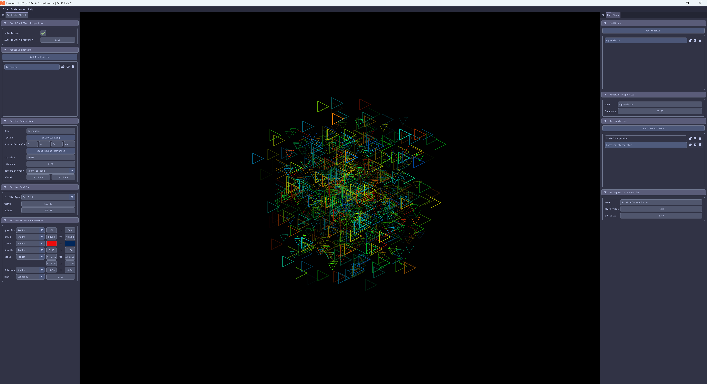

### Main Menu Bar

The main menu bar provides access to editor functions

- **File**: Project management (New, Open, Save, Exit)
  - **New Project**: Create a new project.
  - **Open Project**: Open an existing Ember project.
  - **Save Project**: Saves the currently open project.
  - **Exit**: Exit and close the editor.
- **Preferences**: Interface customization options.
  - **Background Color**: Choose the background color to display in the editor viewport from 100% black, 75% black, 50% black, 25% black, 100% white, or Cornflower Blue
  - **Theme**: Choose the theme (Light or Dark) to use for the editor.
- **About**: Displays the about information box for the editor.

### Viewport

The viewport displays a live preview of your particle effect. The viewport shows exactly how particles will appear when rendered in your game using MonoGame Extended.

Left-clicking anywhere within the viewport will trigger particle emitters to emit at the clicked position.

### Particle Effect Panel

The Particle Effect panel is the primary workspace for configuring your particle effect and its emitters. This panel is organized into collapsible sections for easy navigation.

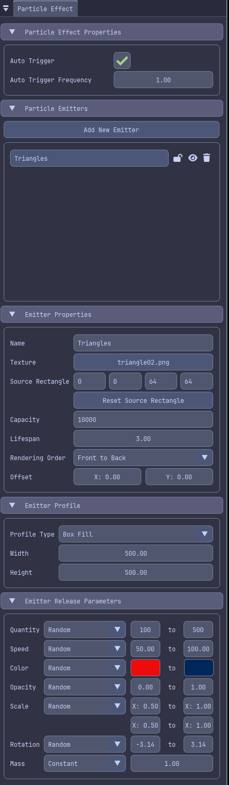

### Modifiers Panel

The Modifiers panel provides control for adding and configuring particle modifiers and interpolators. Modifiers control particle behavior over time, while interpolators creates smooth property transitions.

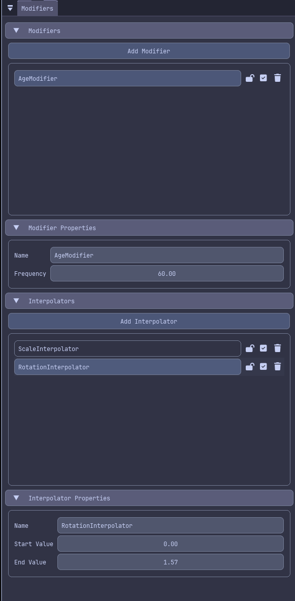

## Working with Particle Effects

A particle effect is a container that holds one or more emitters. The effect itself has properties that apply to all emitters within it.

### Particle Effect Properties

The **Particle Effect Properties** section controls effect-wide settings.

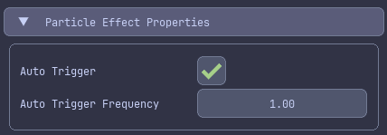

| Property                   | Description                                       |
| -------------------------- | ------------------------------------------------- |
| **Auto Trigger**           | Whether emitters automatically release particles. |
| **Auto Trigger Frequency** | How often emitters auto-trigger (in seconds).     |

:::tip
**Auto Trigger** is particularly useful for continuous effects like fire, smoke, or waterfalls. When enabled, all emitters in the effect will release particle automatically at the specific frequency.
:::

For more information about particle effects, see the [MonoGame Extended Particle System documentation](../features/particles/quick_start_guide.md)

## Working with Particle Emitters

Particle emitters are the core components that create and manage particles. Each emitter has its own appearance, behavior, and lifecycle settings.

### Managing Emitters

The **Emitter List** section displays all emitters in your effect and allows you to manage them.

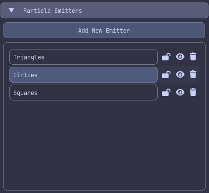

#### Adding Emitters

To add a new emitter, click the **Add Emitter** button. A new emitter with default settings will be added to the list and automatically selected for editing.

#### Selecting Emitters

To select an emitter for editing, click the emitter in the **Emitter List**. Only one emitter can be selected at a time.

#### Reordering Emitters

Emitters can be reordered by click-and-dragging their position within the list. Emitter order affects the visual layering of particles when multiple emitters are active. Emitters at the top of the list are emitted first and will appear behind those lower on the list.

#### Locking Emitters

To lock an emitter so that accidental edits are not made, click the **Lock** button next to the emitter. When an emitter is locked, edits are not allowed to be made to any of its properties or modifiers.

#### Adjusting Emitter Visibility

To change the visibility of an emitter, click the **Visibility** button next to the emitter. This will hide the emitter from being displayed in the viewport. This is useful when there are multiple layered emitters and you need to work with a specific one without the visuals of another distracting you.

#### Removing Emitters

To remove an emitter click the **Remove** icon next to the emitter to delete it.

### Emitter Properties

When an emitter is selected, the **Emitter Properties** section displays its settings:

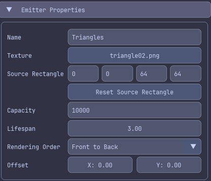

| Property             | Description                                                                                      |
| -------------------- | ------------------------------------------------------------------------------------------------ |
| **Name**             | The display name of the selected emitter.                                                        |
| **Texture**          | The texture used for the visual of each particle emitted by the selected emitter.                |
| **Source Rectangle** | The rectangular bounds within the **Texture** to use for the visual of each particle.            |
| **Capacity**         | Maximum number of particles the selected emitter can manage.                                     |
| **Lifespan**         | How long particles emitted from the selected emitter live (in seconds).                          |
| **Rendering Order**  | Whether particles emitted from the selected emitter render front-to-back or back-to-front.       |
| **Offset**           | Position offset from the particle effect's center position that the selected emitter emits from. |

**Important Property Notes:**

- **Source Rectangle** determines the rectangular bounds within the **Texture** used when rendering the particles. This is useful when using a texture atlas that contains the particle textures for each emitter to reduce the amount of texture swapping.
- **Capacity** determines the maximum number of active particles. If you reach capacity, older particles will need to expire before new ones can be created.
- **Lifespan**: controls how long each particle exists. Shorter life spans create burst effects, while longer lifespans create sustained effects.

### Emitter Textures

Each emitter requires a texture that defines how individual particle look. The **Texture** property in the **Emitter Properties** section controls this.

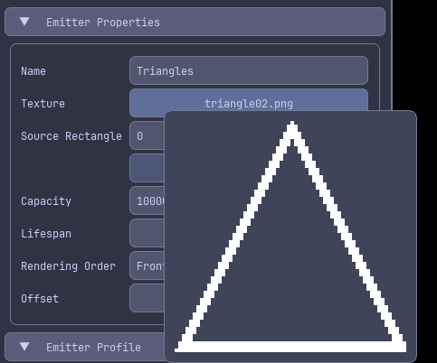

#### Assigning Textures

To assign a texture to a particle emitter, click the **Select Texture** button in the **Emitter Properties**. If a texture was previously assigned, then instead of **Select Texture** it will show the name of the texture already added. In the file dialog, navigate to and select an image file to use. The texture will be loaded and applied to the emitter.

:::note
When a texture is assigned, the image file will be copied locally to the project directory. If an image file already exists with this name in the project directory, a confirmation box will be displayed to confirm overwriting the existing file.
:::

:::tip
When a texture is assigned, a small preview appears when hovering over the select texture button.
:::

For effects like explosions or complex visuals, you may want to use a texture atlas texture. The editor currently support single-texture assignments per emitter, but you can adjust the source rectangle within the texture to use when using an atlas.

### Emitter Profiles

The **Emitter Profile** section determines where particles spawn and their initial direction. MonoGame Extended provides several emission profiles, each creating different spatial patterns.

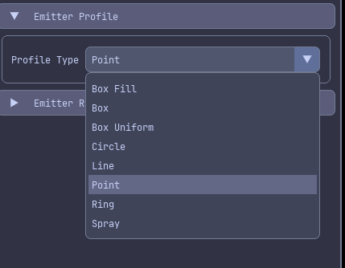

| Profile         | Description                                                                     | Configuration                    |
| --------------- | ------------------------------------------------------------------------------- | -------------------------------- |
| **Box Fill**    | Particles spawn randomly distributed within a rectangular area.                 | Width, Height                    |
| **Box**         | Particles spawn randomly distributed along the edges of a rectangular area.     | Width, Height                    |
| **Box Uniform** | Particles spawn with uniform distribution along the edges of a rectangular area | Width, Height                    |
| **Circle**      | Particles spawn within a circular area                                          | Radiate, Radius                  |
| **Line**        | Particles spawn along a line between two points.                                | Axis, Length, Radiate, Direction |
| **Point**       | All particles spawn at the emitter position and move in random directions.      | *No configuration*               |
| **Ring**        | Particles spawn along the edge of a circular area                               | Radiate, Radius                  |
| **Spray**       | Particles spray in a cone-shaped direction                                       | Spread, Direction                |

#### Configuration Profiles

After selecting a profile type, configuration properties appear below it. These properties control the shape and size of the emission pattern.

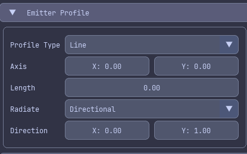

For detailed information about each profile type and their use cases, see the [Emission Profiles documentation](../features/particles/emission_profiles.md)

### EmitterRelease Parameters

The **Emitter Release Parameters** section controls the physical and visual properties of newly created particles. These parameters use a specialized system that allows both constant and random values.

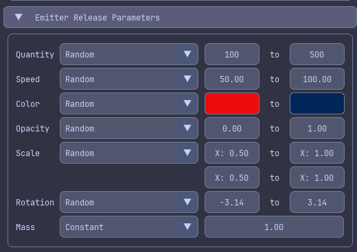

#### Parameter Types

Each parameter can be set to use either

- **Constant**: The same value for every particle
- **Random**: A random value within a specified range for each particle.

Toggle between modes using the **Constant**/**Random** selector for each parameter.

#### Available Parameters

The following parameters are available for configuration for each emitter:

| Parameter    | Description                                             |
| ------------ | ------------------------------------------------------- |
| **Quantity** | Number of particles to create per trigger.              |
| **Speed**    | Initial velocity magnitude (units per second).          |
| **Color**    | Particle tint color.                                    |
| **Opacity**  | Particle transparency (0.0 = invisible, 1.0 = opaque).  |
| **Scale**    | Particle size multiplier (1.0 = original texture size). |
| **Rotation** | Initial rotation angle (in degrees).                    |
| **Mass**     | Particle mass (affects modifier behavior).              |

:::tip
The Color parameter uses HSL (Hue, Saturation, Lightness) color space for intuitive color selection

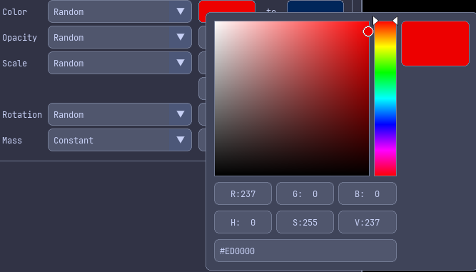

When using **Random** mode for colors, you can set different HSL values for the minimum and maximum range, allowing particles to vary across a spectrum of colors.
:::

#### Parameter Tips

- Use Random ranges to add natural variation to effects. Real-world phenomena like fire and smoke are never perfectly uniform.
- Speed and Scale parameters significantly impact the visual feel. Experiment with different values.
- For explosion effects, use high Speed values with Random ranges.
- For subtle ambient effects, use lower Speed values and longer Lifespans
- Opacity can create fade-in effects with combined with interpolators (covered in the Interpolators section).

For more technical details about release parameters, see the [MonoGame Extended Particle System Quick Start Guide](../features/particles/quick_start_guide.md).

## Working with Modifiers

Modifiers control how particles change and behave over time. While release parameters set initial particle properties, modifiers transform these properties through the particle's lifetime.

### Managing Modifiers

Modifiers are managed in the **Modifiers** panel. Before you can add modifiers, you must have at least one emitter created and selected.

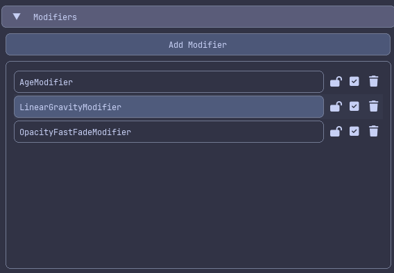

#### Adding Modifiers

To add a new modifier, click the **Add Modifier** button. A popup will appear with a choice of which modifier you would like to add. Choose the desired modifier from the popup and click the **Select** button. The new modifier will appear in the list and is automatically selected.

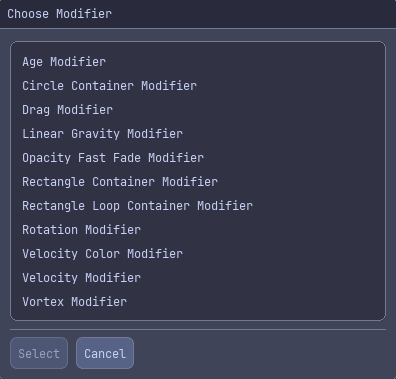

| Modifier Type                         | Description                                                                                |
| ------------------------------------- | ------------------------------------------------------------------------------------------ |
| **Age Modifier**                      | Applies interpolators based on particle lifetime.                                          |
| **Circle Container Modifier**         | Constrains particles within a circular boundary.                                           |
| **Drag Modifier**                     | Applies air resistance to slow particles over time.                                        |
| **Linear Gravity Modifier**           | Applies gravity in any direction.                                                          |
| **Opacity Fast Fade Modifier**        | Rapidly decreases particle opacity based particle lifetime.                                |
| **Rectangle Container Modifier**      | Constrains particles within a rectangular boundary.                                        |
| **Rectangle Loop Container Modifier** | Wraps particles to the opposite side of a rectangular boundary when the exit the boundary. |
| **Rotation Modifier**                 | Applies a constant rotation velocity to particles over time.                               |
| **Velocity Color Modifier**           | Changes particle color based on velocity.                                                  |
| **Velocity Modifier**                 | Applies interpolators based on particle velocity.                                          |
| **Vortex Modifier**                   | Creates a gravitational vortex effect, pulling particles toward a central point.           |

#### Selecting Modifiers

To select a modifier, click the modifier in the **Modifier List**. Only one modifier can be selected at a time.

#### Reordering Modifiers

Modifiers can be reordered by click-and-dragging their position within the list. Modifier order in the list affects the order in which the modifiers are applied to particles.

:::warning
**Modifier execution order matters!** Modifiers are applied sequentially, so later modifiers see changes from earlier ones.
:::

#### Locking Modifiers

To lock a modifier so accidental edits are not made, click the **Lock** button next to the modifier. When a modifier is locked, editors are not allowed to be made to any of its properties. If the modifier supports interpolators, then editing its interpolators are also locked.

#### Disabling Modifiers

To disable a modifier without removing it, click the **Disable** button next to the modifier. Disabling a modifier will prevent it from affecting the particles in the emitter.

#### Removing Modifiers

To remove a modifier, click the **Remove** icon next to the modifier.

### Modifier Properties

All modifiers have the following properties:

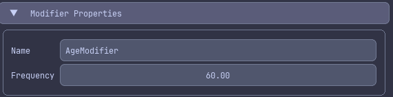

| Property      | Description                                           |
| ------------- | ----------------------------------------------------- |
| **Name**      | Display name of the modifier.                         |
| **Frequency** | How often the modifiers updates particles per second. |

:::tip
Frequency controls the update rate. Lower values (e.g. 30.0) reduce CPU usage but make the modifier less smooth. Higher values (e.g. 120.0) create smoother results but use more CPU. The default 60.0 works well for most effects.
:::

Each modifier type has additional properties specific to its function. For detailed information about each modifier type and its properties, see the [MonoGame Extended Modifiers documentation](../features/particles/modifiers.md)

## Working with Interpolators

Interpolators create smooth transitions of particle properties over time. They work in conjunction with the **Age Modifier** and **Velocity Modifier** to create effects like fading, color shifts, scaling, and more.

### Managing Interpolators

Interpolators are added to either an **Age Modifier** or **Velocity Modifier**. You must have one of these modifier types added and selected before you can create interpolators.

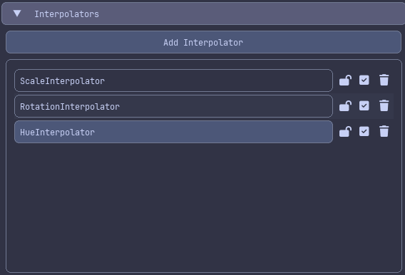

#### Adding Interpolators

To add a new interpolator, click the **Add Interpolator** button. A popup will appear with a choice of which interpolator you would like to add. Choose the desired interpolator from the popup and click the **Select** button. The new interpolator will appear in the list and is automatically selected.

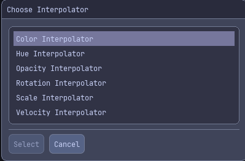

| Interpolator              | Description                                                                           |
| ------------------------- | ------------------------------------------------------------------------------------- |
| **Color Interpolator**    | Gradually changes the color components (Hue, Saturation, and Lightness) of particles. |
| **Hue Interpolator**      | Gradually changes only the Hue color component of particles.                          |
| **Opacity Interpolator**  | Gradually changes the opacity of particles.                                           |
| **Rotation Interpolator** | Gradually changes the rotation of particles.                                          |
| **Scale Interpolator**    | Gradually changes the scale of particles.                                             |
| **Velocity Interpolator** | Gradually changes the velocity of particles.                                          |

#### Selecting Interpolators

To select an interpolator, click the interpolator in the **Interpolator List**. Only one interpolator can be selected at a time.

#### Reordering Interpolators

Interpolators can be reordered by click-and-dragging their position within the list. Unlike emitters and modifiers, interpolator order typically doesn't affect the visual result, as each interpolator operates on different particle properties independently.

#### Locking Interpolators

To lock an interpolator so that accidental edits are not made, click the **Lock** button next to the interpolator. When an interpolator is locked, edits are not allowed to be made to any of its properties.

#### Disabling Interpolators

To disable an interpolator without removing it, click the **Disable** button next to the interpolator. Disabling an interpolator will prevent it from affecting the particles in the emitter.

#### Removing Interpolators

To remove an interpolator, click the **Remove** icon next to the interpolator.

### Interpolator Properties

When an interpolator is selected, the **Interpolator Properties** section displays its settings

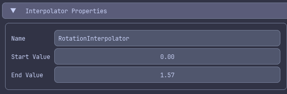

All interpolators share these properties:

| Property | Description |
| --- | --- |
| **Name** | Display name for the interpolator. |
| **Start Value** | The value at the beginning of interpolation. |
| **End Value** | The value at the end of interpolation. |

### How Interpolation Works

Interpolators calculate the intermediate values between **Start Value** and **End Value** based on progress:

- **With Age Modifier**: Progress is based on particles lifetime (0.0 = birth, 1.0 = death).
- **With Velocity Modifier**: Progress is based on particle speed with a configurable threshold.

For example, an **Opacity Interpolator** with:

- **Start Value**: 1.0 (fully opaque).
- **End Value**: 0.0 (fully transparent).

Will create a fade-out effect where particles gradually become invisible.

For detailed information about interpolators, see the [MonoGame Extended Particle System: Interpolator Guide](../features/particles/interpolators.md)

## Additional Resources

For more information about the MonoGame Extended particle system:

- [MonoGame Extended Particle System Quick Start Guide](../features/particles/quick_start_guide.md)
- [MonoGame Extended Particle System: Emission Profiles Guide](../features/particles/emission_profiles.md)
- [MonoGame Extended Particle System: Modifiers Guide](../features/particles/modifiers.md)
- [MonoGame Extended Particle System: Interpolator Guide](../features/particles/interpolators.md)

For editor issues, feature requests, or contributions:

- [GitHub Repository](https://github.com/monogame-extended/ember)

